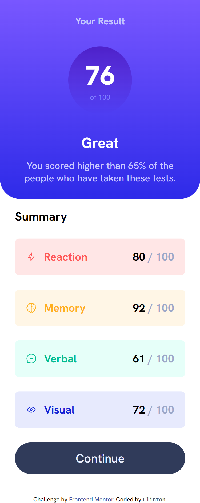

# Frontend Mentor - Results summary component solution

This is a solution to the [Results summary component challenge on Frontend Mentor](https://www.frontendmentor.io/challenges/results-summary-component-CE_K6s0maV). Frontend Mentor challenges help you improve your coding skills by building realistic projects. 

## Table of contents

- [Overview](#overview)
  - [The challenge](#the-challenge)
  - [Screenshot](#screenshot)
  - [Links](#links)
- [My process](#my-process)
  - [Built with](#built-with)
  - [What I learned](#what-i-learned)
  - [Continued development](#continued-development)
  - [Useful resources](#useful-resources)
- [Author](#author)


## Overview

This addresses the challenge of the [Results summary component challenge on Frontend Mentor], and it has been coded by clintt-09.

While I couldn't do the Bonus challenge(due to my lack of understanding of Javascript), I made sure to replicate the Mobile and Desktop designs with just HTML & CSS.

Two screenshots are available, showcasing the Desktop and Mobile views. Additionally, there are provided links to both the Solution on Frontend Mentor and the live site hosted on Netlify.

### The challenge

Users should be able to:

- View the optimal layout for the interface depending on their device's screen size
- See hover and focus states for all interactive elements on the page
- **Bonus**: Use the local JSON data to dynamically populate the content

### Screenshot

Desktop view (1440 x 1080)


Mobile view (375 x 809)



### Links

- Solution URL: [Solution on Frontend Mentor](https://www.frontendmentor.io/solutions/responsive-summary-component-with-flexbox-_V3BJCxO2l)
- Live Site URL: [ace-11.netlify.app](https://ace-11.netlify.app/)


## My process
Here are the tools and technologies I employed to address this challenge, insights gained throughout the problem-solving journey, areas in which I aspire to enhance my skills in the coming days, and articles that proved beneficial for me, potentially aiding others in overcoming similar challenges on Frontend Mentor or elsewhere.

This is the approach I took to address this challenge. 

### Built with

- Semantic HTML5 markup
- CSS custom properties
- Flexbox
- CSS Grid
- Mobile-first workflow

### What I learned

Gradients in CSS has been to tough topic for me to understand for some time now. But I used this Challenge as a starting point to conquer the issue. Gradients isn't a diificult topic to be honest, I just needed the right material.

Here is how I used CSS to apply gradients on an element in my stylesheet:

```css
.result {
  background: linear-gradient(to top, hsl(241, 81%, 54%), hsl(252, 100%, 67%));
}
```

### Continued development

With this challange done, I finally feel like I have a firm grip on responsive design. I struggled for months but now I realize the only way to truly learn and understand is through practice. I will only get better from here on out. Its truly euphoric to see my growth. LIVE!

### Useful resources

- [web.dev](https://web.dev/learn) - This site really helped me out more than anything else I found online. It explained Gradients so well that I finally solved the problem that was holding me back from finishing this challenge for weeks (mostly because I kept putting it off). It's a fantastic place to learn not just CSS but everything about web development. Definitely give it a visit!


## Author

- Frontend Mentor - [@clintt-09](https://www.frontendmentor.io/profile/clintt-09)
- Twitter - [@clinttfr](https://www.twitter.com/clinttfr)
